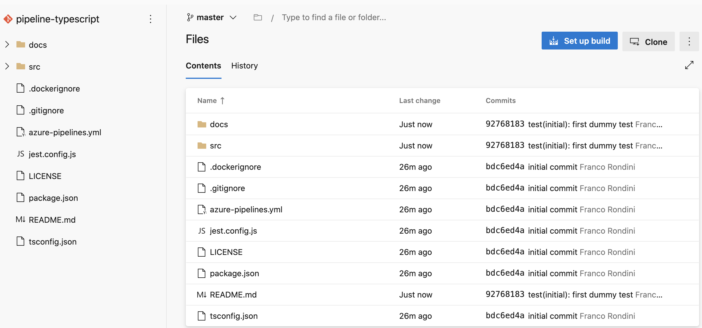
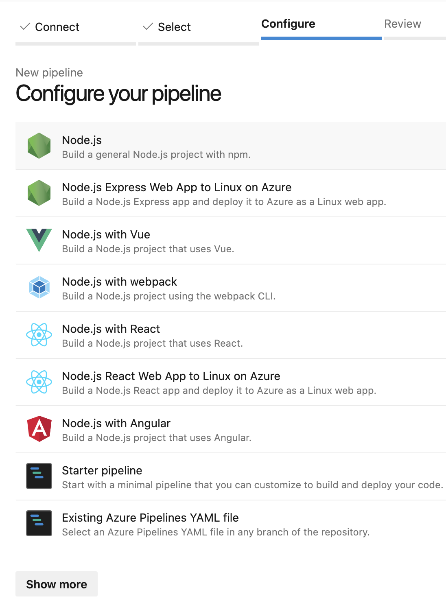
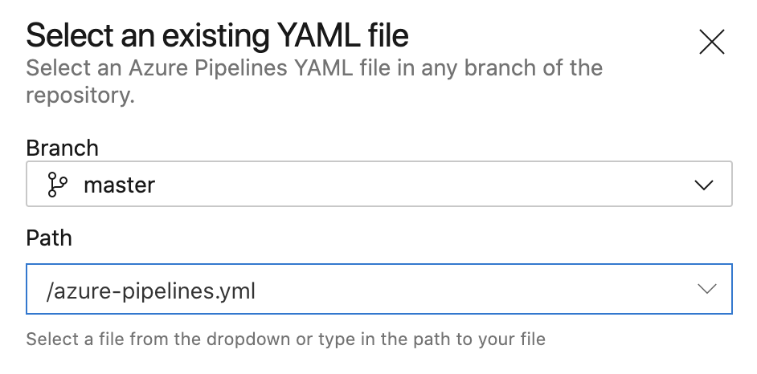
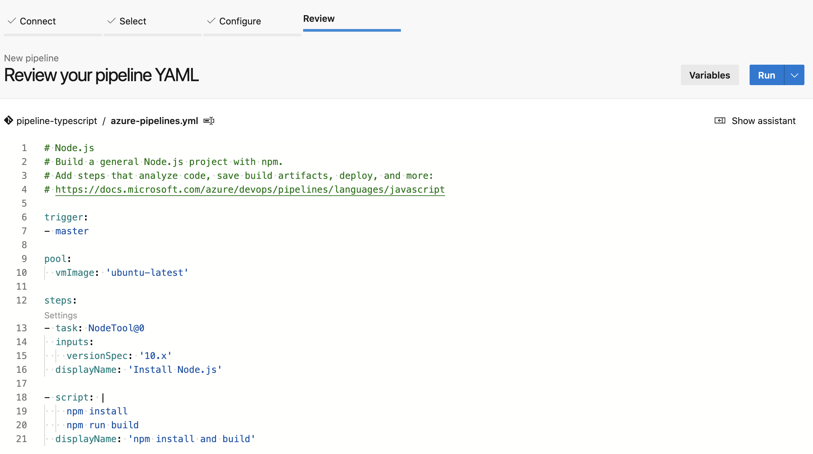
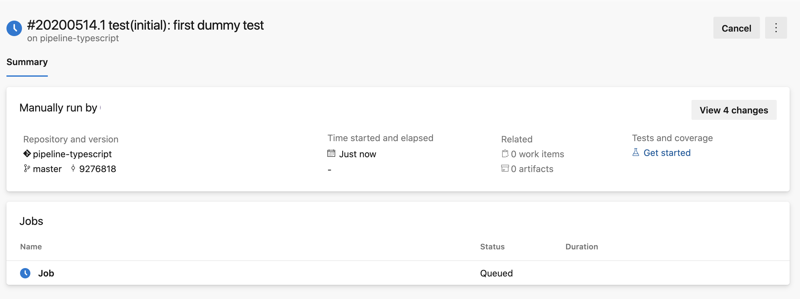
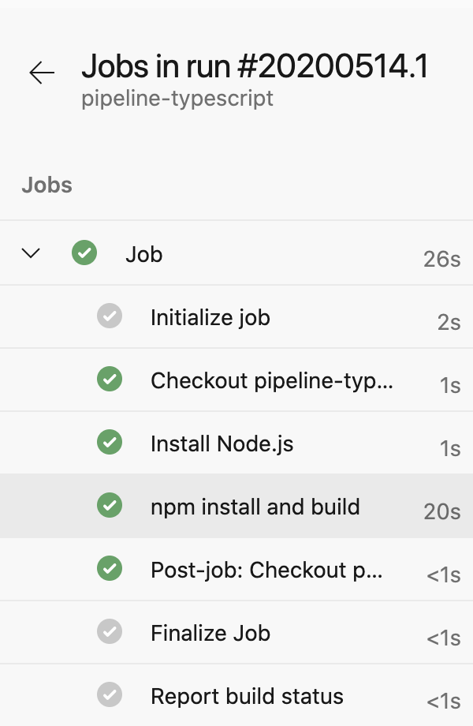
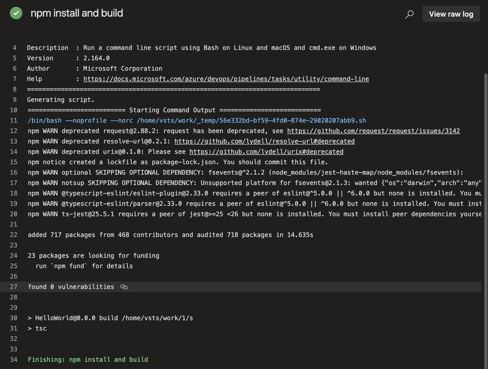
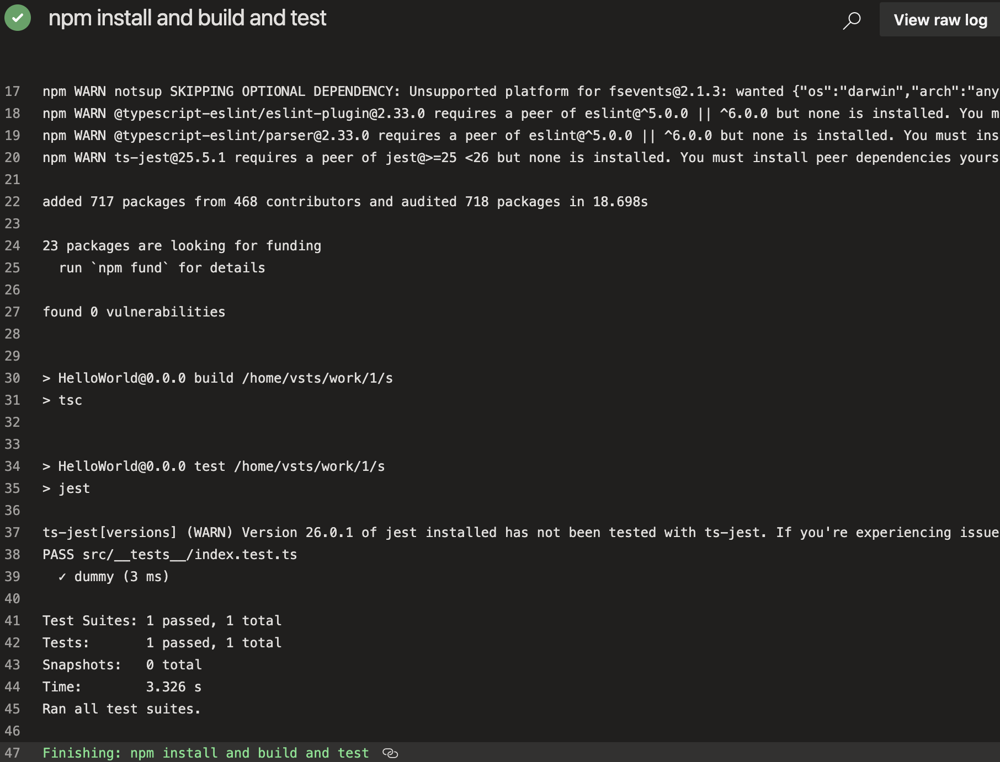

# setup build and tests on azure pipelines
## setup up build

## configure pipeline

## select an existing yaml

## review your pipeline

## run pipeline

## review jobs in run

## inspect logs

## add unit tests to the pipeline

